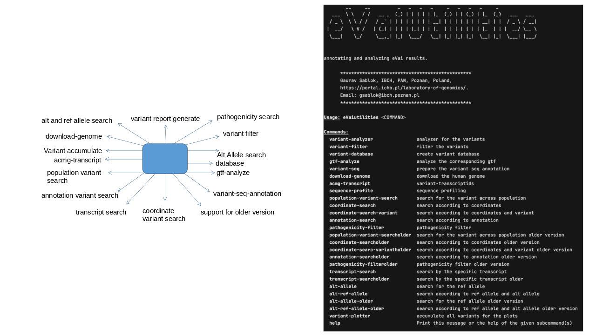

# Summary
Analyzing and identifying genomic variants is particularly helpful in case of linking the disease onset to the genomic predictions. Genomic variants play a key role in the identification and characterization of the disease onset and also allow for interlinking genomic variability and hypothesis testing. eVai, which is a variant annotation platform provides annotation of the genomic variants using several backend open source databases and tools. eVaiutilities proposed in this paper, is a post-eVAI analyzer for population scale analysis for eVAI variant annotation. It allows the analysis of the genomic variants further such as analyzing the multiple genomic annotated variants, reference and alternate allele, enabling coordinate search, coordinate search with specified variants and annotation search across a large number of population. The availability of the command line parameters allows for a large scale analysis across the several population files. eVAI has been used by many people and has been very well cited, so the lack of the use of the command line for the high-throughput analysis promoted to develop eVaiutilities. Email: gsablok@ibch.poznan.pl

# Statement of need

Human genomics has always been an intriguing and gleaming topic of interest. Many efforts have been laid for understanding and identifying variants. Apart from the open source genomics efforts, proprietary efforts have been developed for the identification and annotation of the variants. The identified variants have been classified and linked to genetic and metabolic disorders, with severity ranging from pathogenic to highly pathogenic. One such effort is the eVai https://www.engenome.com/product/, which is a high throughput variant annotator, and provides the hierarchical classification of the genomic variants. However, the limitation of the eVai output files is the information spanning across the multiple files and the missing of the genome information and sub-sequence analysis on the annotated variants. eVaiutilities allows, you to use the output from the eVai and performs genome scale analysis of the eVai annotated variants. It allows you to search across populations, variants and spanning information across multiple samples. It is encoded in RUST, which is a memory safe language and provides scalability.

# Figures

# eVaiutilities

Variant identification and annotation across the human genome has wide biological significance and is of utmost importance taking into account the wide growth of the disease onset that are happening worldwide.  Many tools have been developed for the annotation of the variants that focuses on the annotation of the variants using the several pre-established database [@Wang2010-mh, @Obenchain2014-jj]. Apart from the significant development in the open source genomics [@McLaren2016-jo] [@Pedersen2022Echtvar], parallel efforts have been laid down for the variant identification and annotation in industrial research. eVai https://www.engenome.com/product/, provides customary analysis of variants by comparing the variants across the several tools and databases and provides TSV files with the annotations mapped. However, customary analysis is needed to make personal genomics easier. Additionally, for large scale variant searching, speed and scalability is needed. To address all these issues, eVaiutilities has been built using the RUST memory safe language features. eVaiutilities provides a compendium of options to allow for the searching of the variants across the population and generate customary analysis. It provides from variant report generation to the user specified database and sequence annotation. eVaiutilities features such as the transcript sequence to sequence spanning around the variants, allow the ease of the access to generate the molecular methods for the variants of interest and also allows for the categorical variant filtering. There are several features present in the eVaiutilities such as population wide analysis of a particular variant, coordinate search for variants across population, variant search across the specific coordinates with the specified variant across population, sequence specific analysis, reference and alternate allele search across the population. All the aforementioned features makes eVaiutilties an easy to use data management software for doing the customary analysis with the eVai. eVaiutilities is available from https://github.com/IBCHgenomic/eVaiutilities and is also available as a crate from https://crates.io/crates/eVaiutilities and uses RUST version: rustc 1.89.0.

# References
